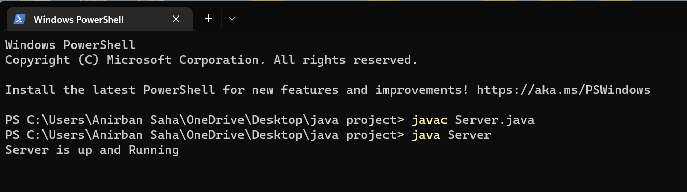
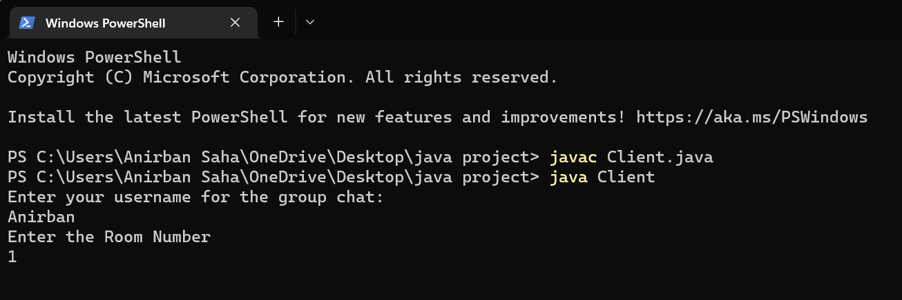
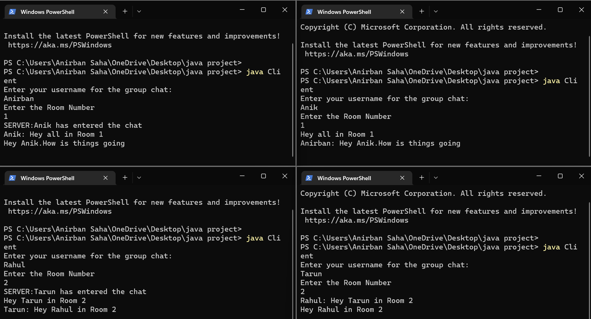

# Group-Chat
This is a group chat application where user can access different chat room.
User can access a particular chat room and will be able to listen and write in that chat room only.

<h2>To run the application</h2>
Run the followings commands.
<h3>To start the server</h3>

```
javac Server.java
java Server
```



<h3>To start indivial Client for each user</h3>

```
javac Client.java
java Client
```

Enter the user-name and select the room number



Now if we see the below screenshot it shows that user in room 1 cannot see the messages in room 2 and vice-versa


